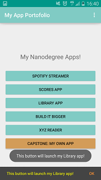

# Android Nanodegree Program
============

## MyAppPortfolio
-------

Design and build a layout in Android Studio for an app that showcases your app portfolio. Each button represents an app that you'll build in the Nanodegree program.

## Popular Movies, Stage 1
-------

Build a movies Application with an grid arrangement which allow the user to change sort order by most popular, or by highest-rated. Using themoviedb.org API

Tap on a movie poster allow a transition to a details screen with additional information : 

- original title
- movie poster image thumbnail
- a plot synopsis
- user rating 
- release date

##License
-------

    Copyright 2015 Marc Daniel

    Licensed under the Apache License, Version 2.0 (the "License");
    you may not use this file except in compliance with the License.
    You may obtain a copy of the License at

       http://www.apache.org/licenses/LICENSE-2.0

    Unless required by applicable law or agreed to in writing, software
    distributed under the License is distributed on an "AS IS" BASIS,
    WITHOUT WARRANTIES OR CONDITIONS OF ANY KIND, either express or implied.
    See the License for the specific language governing permissions and
    limitations under the License.

## Contact
-------
#### Daniel Marc
* e-mail: [@mail](marc.daniel.mail@gmail.com "marc.daniel.mail@gmail.com")